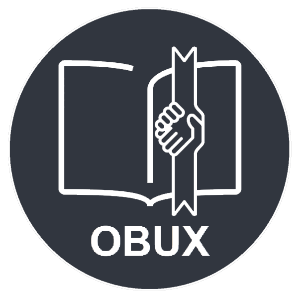

# Obux
##### [Clique aqui para a versão em português](./readmeStuff/readmeBR.md)


<p align="center" style="display: flex; align-items: center; justify-content: space-around">
  
</p>
<p align="center">Obux is an app that helps you borrow and trade books with other people.</p>
<br/>

Obux Will let you trade books with someone that has a book of your interest, borrow someone's else book or put your own books up for trades and for other people to borrow.
<br/>

## Technologies Used
<p align="center" style="display: flex; align-items: center; justify-content: space-around">
  
  
  
  
</p>

For this project, we've used NestJS for the Backend, MySQL (TypeOrm) for database and ReactNative for the Frontend (Expo).
<br/>

## Documentation Summary
* ### [How to run](#how-to-run-it)
* ### [Endpoints](#project-endpoints)
* ### [Models](#project-models)

## How to run it
#### BackEnd
First you got to setup the BackEnd. For this, download [NodeJS](https://nodejs.org/en/)
<br/>
After it, you must download the dependencies by executing the following commands

```console
hello@world:~$ yarn
```

And now, all you gotta you do is run. Just run this command (Don't forget to set the environment variables in a .env file)

```console
hello@world:~$ yarn start:dev
```

#### FrontEnd
First, you've gotta download and install Expo. After it, run the following command in the frontend folder.

```console
hello@world:~$ yarn
hello@world:~$ expo start
```

# Project Endpoints

### User Endpoints
|       Route           |    Method    |                   Description                    |                                                                         
|   :---------------:   | :----------: | :----------------------------------------------: |                                                                           
|  `/users/create`        |    POST      |  Route that creates a User                       |                                                         
|  `/users/get/:id`       |    GET       |  Gets the user by its ID                         |   
|  `/users/login`             |    POST      |  Route for user login                            |                                                        
|  `/users/deluser/:id`       |    DELETE    |  Deletes the user by its ID                      |                 
|  `/users/update/:id`    |    PUT       |  Updates the user by its ID                      |                                                     
|  `/rateuser`          |    POST      |  Creates a rating for the user based on reviews  |
|  `/finduser`          |    POST      |  Find a user by its city and/or state            | 

### Book Endpoints
|       Route       |    Method    |                                 Description                                  |                                                                                                          
| :--------------:  | :----------: | :--------------------------------------------------------------------------: |                                                                           
|  `/books/create`   |    POST      |   Route that creates a book                                                  |                                                         
|  `/books/get/:id`  |    GET       |   Gets book by its ID                                                        |   
|  `/books/delete/:id`|    DELETE    |   Delete book by its ID                                                      |                                                        
|  `/books/update/:id` |    PUT       |   Updates a book by its ID                                                   |                 
|  `/books/find`      |    POST      |   Route to search for books by its name, genre, year or author               |

### Pass Recovery Endpoints
|       Route            |    Method    |                                 Description                                  |                                                                                                          
| :--------------:       | :----------: | :--------------------------------------------------------------------------: |                                                                           
|  `/request`            |    POST      |   Route that sends the pass recovery email                                                  |                                                         
|  `/recovery/:token`   |    GET       |   Checks token                                                       |   
|  `/redefinepassword/:token`         |    POST    |   Redefine password                                                      |                                                        

# Project Models

### User Schema
| FieldName  | Translated    | Type                                   | Required | Unique |
|:------------:|:---------------:|:----------------------------------------:|:---------:|:--------:|
| `nome`       | name          | String                                 | true    | false  |
| `dataNasc`   | birthday      | Date                                   | true    | false  |
| `telefone`   | mobile number | String                                  | false   | false  |
| `email`      | email         | String                                 | true    | true   |
| `cpf`        | cpf           | String                                 | true    | true   |
| `senha`      | password      | String                                 | true    | false  |
| `cidade`     | city          | String                                 | true    | false  |
| `estado`     | state         | String                                 | true    | false  |
| `biblioteca` | library       | ObjectId                               | false   | false  |
| `pfp`        | profile pic   | String                                 | false   | false  |
| `givenrates` | givenrates    | Number                                 | false   | false  |
| `totalrates` | totalrates    | Number                                 | false   | false  |


### Book Schema
| FieldName       | Translated   | Type   | Required |
|:-----------------:|:--------------:|:--------:|:---------:|
| `titulo`          | title        | String | true    |
| `autor`           | author       | String | false   |
| `ano`             | year         | String | false   |
| `genero`          | genre        | String | false   |
| `qualidade`       | quality      | String | true    |
| `foto`            | photo        | String | false   |
| `disponibilidade` | availability | Number | true    |
| `sinopse`         | synopsis     | String | false   |

### Transaction Schema
| FieldName       | Translated   | Type   | Required |
|:-----------------:|:--------------:|:--------:|:---------:|
| `due`             | due          | Date   | true    |
| `user`            | user         | ObjectId | false   |
| `receiver`            | receiver         | ObjectId | false   |

## Design
[Click here to check the app design at figma](https://www.figma.com/file/tAH0UaEkDmD9pgSNjInOwj/Untitled?node-id=157%3A177)

## Project status
Want to keep track of the currently project status? [Just follow this link (portuguese only)](https://trello.com/b/mT6extOx/obux)

# Missing Something? Something is not working?
* Open a GitHub issue, or
* Send a pull request

## Project members
|  | 
|---|---
| <a href="https://github.com/jonatasfernandespimenta">Jônatas</a> | <a href="https://github.com/LucaKmit">Luca</a> 
